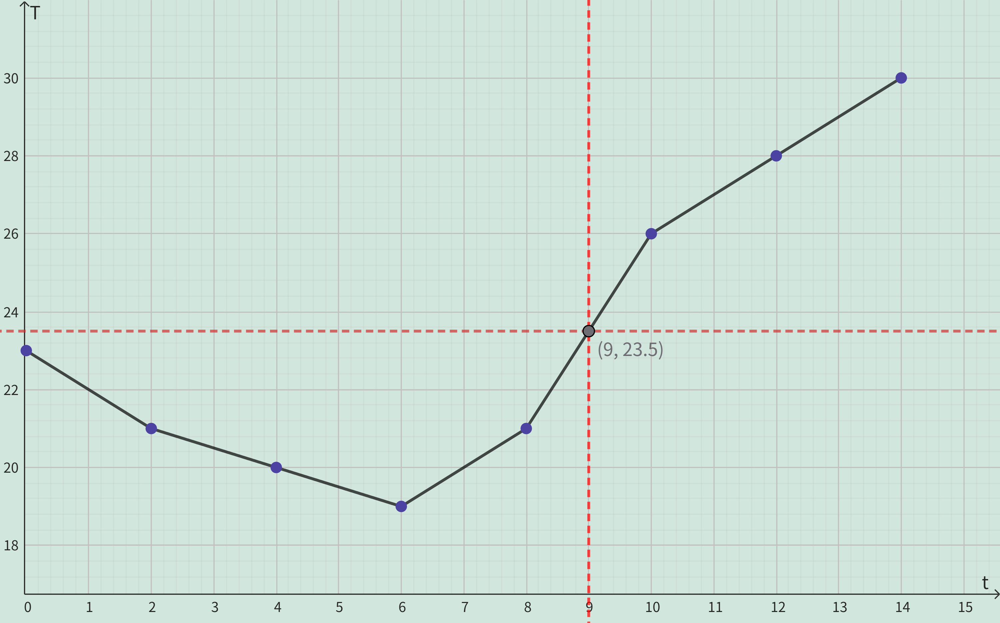

<h4 class="alert-heading">Problem 31</h4>

Temperature readings $T$ (in $\degree C$) were recorded every two hours from midnight to 2:00 pm in Atlanta on a day in June. The time $t$ was measured in hours from midnight.

<table style="display:inline">
    <tr>
        <td style="background-color: #aaffea; font-weight: 600;"> t </td>
        <td>0</td><td>2</td><td>4</td><td>6</td><td>8</td><td>10</td><td>12</td><td>14</td>
    <tr>
    <tr>
        <td style="background-color: #aaffea; font-weight: 600;"> T </td>
        <td>23</td><td>21</td><td>20</td><td>19</td><td>21</td><td>26</td><td>28</td><td>30</td>
    <tr>
</table>

1. Use the readings to sketch a rough graph of $T$ as a function of $t$.

2. Use your graph to estimate the temperature at 9:00 am.

<h4 class="alert-heading">Solution</h4>

According to the graph above, the temperature at 9:00 am is about $23.5 \degree C$.

