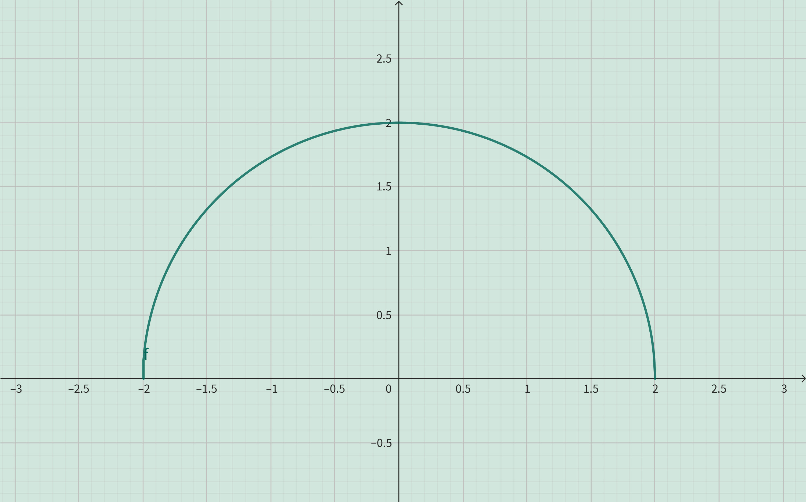

<h4 class="alert-heading">Problem 47</h4>

Find the domain and range and sketch the graph of the function $\displaystyle h(x)=\sqrt{4-x^2}$.

<h4 class="alert-heading">Solution</h4>

Since the radicand must be greater than or equal to $0$, so

$$ 4-x^2 \ge 0 \implies x^2 \le 4 \implies -2 \le x \le 2 $$

Therefore, the domain is $[-2, 2]$.

Because $0 \le x^2 \le 4$, so $0 \le \sqrt{4-x^2} \le 2$,

Therefore, the range is $[0, 2]$.

The graph of this function is as follows: 

