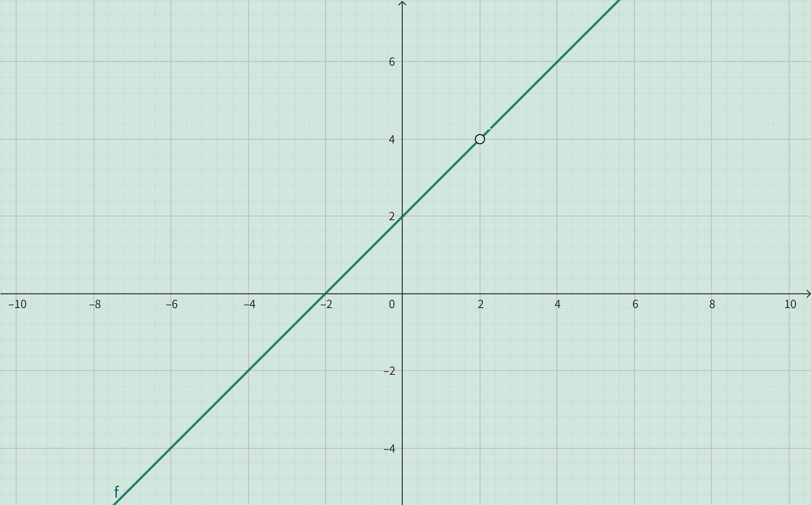

<h4 class="alert-heading">Problem 48</h4>

Find the domain and sketch the graph of the function 

$$
f(x)=\frac{x^2-4}{x-2}
$$

<h4 class="alert-heading">Solution</h4>

Since the denominator cannot be $0$, so 

$$ x-2 \ne 0 \implies x \ne 2$$

Therefore, the domain is $\mathbb{R}-\{2\}$.

With $x \ne 2$, the original function expression can be simplified as

$$
f(x)=\frac{x^2-4}{x-2} = \frac{(x-2)(x+2)}{x-2} = x+2 \quad (x \ne 2)
$$

So the graph of this function is as follows:

