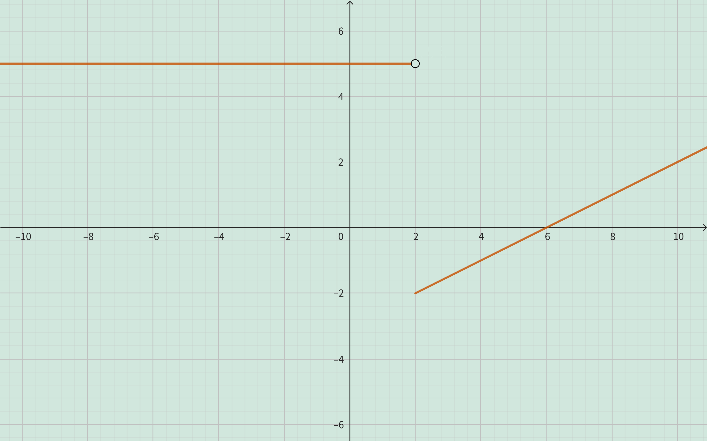
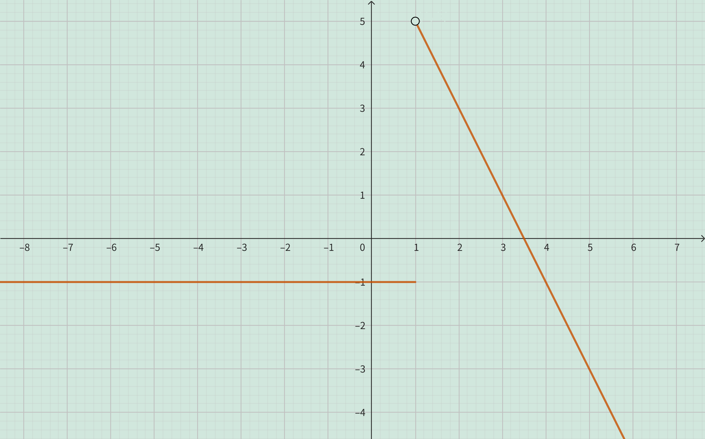

<h4 class="alert-heading">Problem 49-52</h4>

Evaluate $f(-3)$, $f(0)$, and $f(2)$ for the piecewise defined function. Then sketch the graph of the function.

49. $\displaystyle f(x) = \begin{cases} x^2+2 \quad &\text{if\ } x<0\\ x \quad &\text{if\ } x \ge 0\end{cases}$

50. $\displaystyle f(x) = \begin{cases} 5 \quad &\text{if\ } x<2\\ \frac{1}{2}x-3 \quad &\text{if\ } x \ge 2\end{cases}$

51. $\displaystyle f(x) = \begin{cases} x+1 \quad &\text{if\ } x \le -1\\ x^2 \quad &\text{if\ } x > -1\end{cases}$

52. $\displaystyle f(x) = \begin{cases} -1 \quad &\text{if\ } x \le 1\\ 7-2x \quad &\text{if\ } x > 1\end{cases}$

<h4 class="alert-heading">Solution</h4>

**Problem 49**

<!-- tabs:start -->

#### **Evaluation**

$f(-3) = (-3)^2+2 = 11$

$f(0) = 0$

$f(2) = 2$

#### **Graph**

<!-- tabs:end -->

--------

**Problem 50**

<!-- tabs:start -->

#### **Evaluation**

$f(-3) = 5$

$f(0) = 5$

$f(2) = \frac{1}{2} \cdot 2 - 3 = 1-3=-2$

#### **Graph**

<!-- tabs:end -->

--------

**Problem 51**

<!-- tabs:start -->

#### **Evaluation**

$f(-3) = -3+1=-2$

$f(0) = 0^2=0$

$f(2) = 2^2 = 4$

#### **Graph**

<!-- tabs:end -->

--------

**Problem 52**

<!-- tabs:start -->

#### **Evaluation**

$f(-3) = -1$

$f(0) = -1$

$f(2) = 7-2 \cdot 2 = 7-4=3$

#### **Graph**

<!-- tabs:end -->

