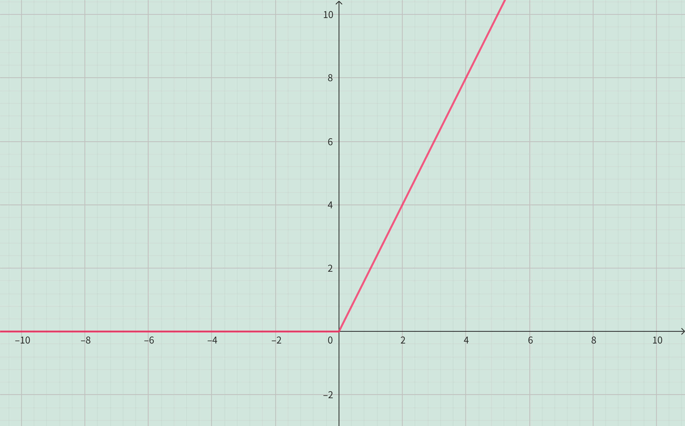
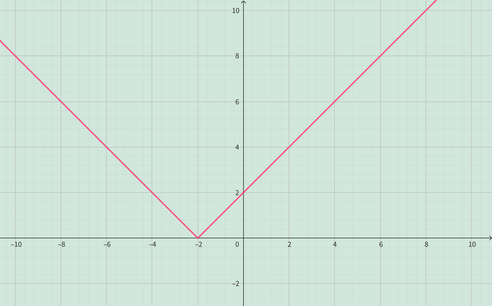
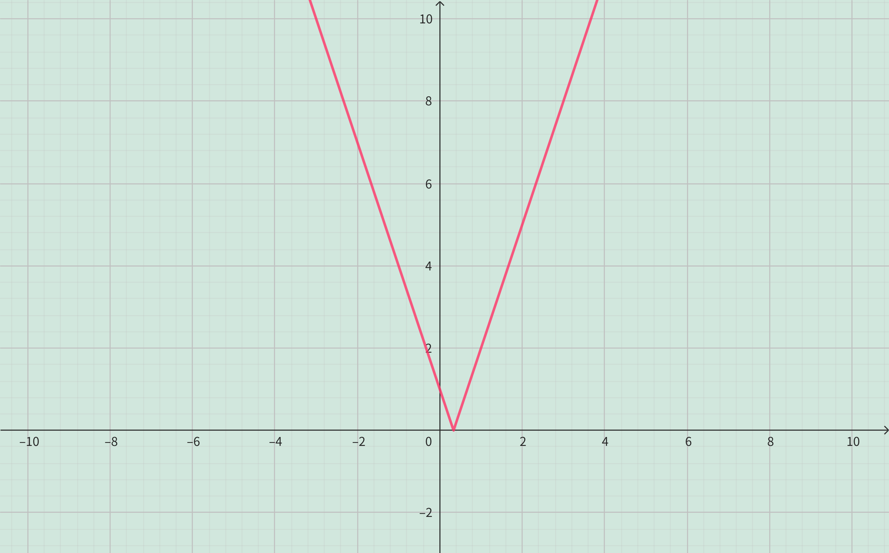
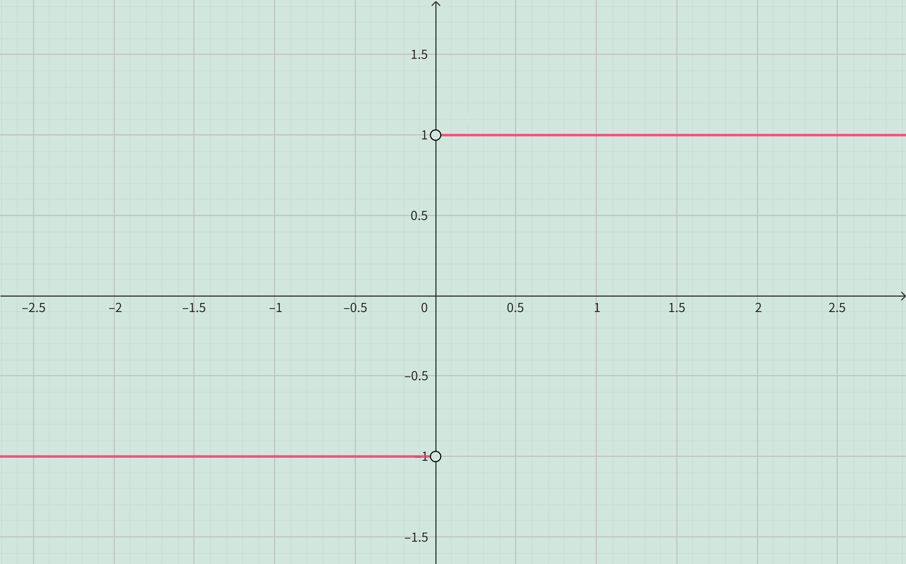
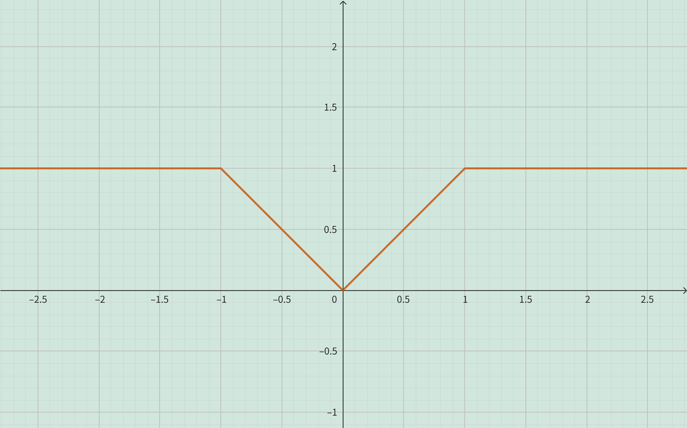
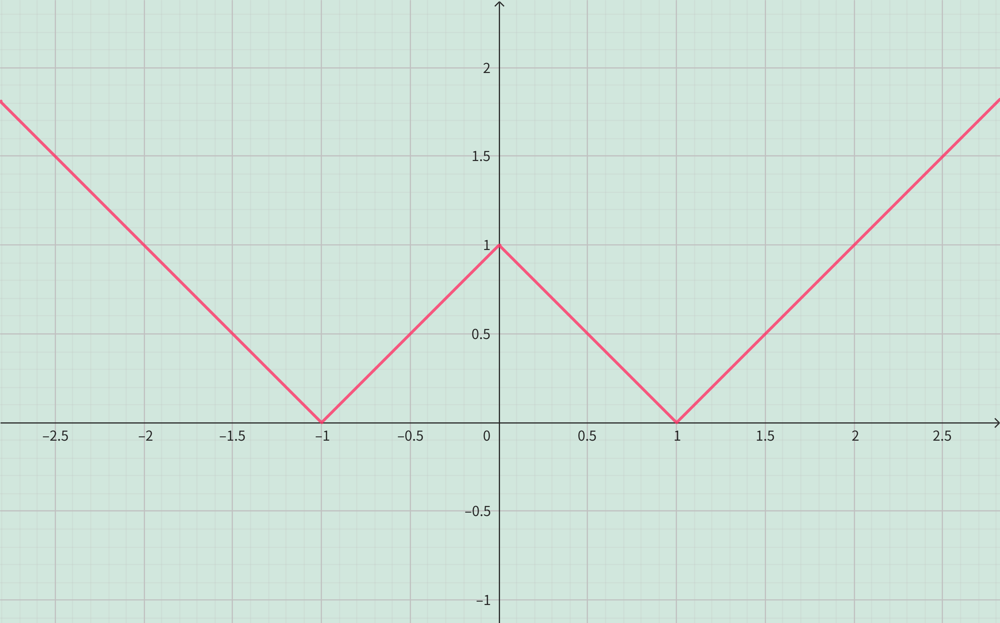

<h4 class="alert-heading">Problem 53-58</h4>

Sketch the graph of the function.

53. $\displaystyle f(x) = x + |x|$

54. $\displaystyle f(x) = |x+2|$

55. $\displaystyle g(t) = |1-3t|$

56. $\displaystyle f(x) = \frac{|x|}{x}$

57. $\displaystyle f(x) = \begin{cases} |x| \quad &\text{if\ } |x| \le 1\\ 1 \quad &\text{if\ } |x| > 1\end{cases}$

58. $\displaystyle g(x) = ||x|-1|$

<h4 class="alert-heading">Solution</h4>

**Problem 53**

$\displaystyle f(x) = x + |x| = \begin{cases} 0  \quad &\text{if \ } x \le 0 \\ 2x  \quad &\text{if \ } x>0 \end{cases}$

--------

**Problem 54**

$\displaystyle f(x) = |x+2| = \begin{cases} x+2  \quad &\text{if \ } x \ge -2 \\ -x-2  \quad &\text{if \ } x<-2 \end{cases}$

--------

**Problem 55**

$\displaystyle g(t) = |1-3t| = \begin{cases} 1-3t  \quad &\text{if \ } x \le \frac{1}{3} \\ 3t-1  \quad &\text{if \ } x>\frac{1}{3} \end{cases}$

--------

**Problem 56**

$\displaystyle f(x) = \frac{|x|}{x} = \begin{cases} 1 \quad &\text{if \ } x > 0 \\ -1 \quad &\text{if \ } x<0 \end{cases}$

--------

**Problem 57**

$\displaystyle f(x) = \begin{cases} |x| \quad &\text{if\ } |x| \le 1\\ 1 \quad &\text{if\ } |x| > 1\end{cases} = \begin{cases} x \quad &\text{if\ } 0 \le x \le 1 \\ -x \quad &\text{if\ } -1 \le x < 0 \\ 1 \quad &\text{if\ } x > 1 \text{\ or \ } x < -1\end{cases}$

--------

**Problem 58**

$\displaystyle g(x) = ||x|-1| = \begin{cases} |x|-1 \quad &\text{if\ } |x| \ge 1 \\ 1-|x| \quad &\text{if\ } 0 \le |x| < 1 \end{cases} = \begin{cases} x-1 \quad &\text{if\ } x \ge 1 \\ -x-1 \quad &\text{if\ } x \le -1 \\ 1-x \quad &\text{if\ } 0 \le x < 1 \\ 1+x \quad &\text{if\ } -1 < x < 0\end{cases}$

