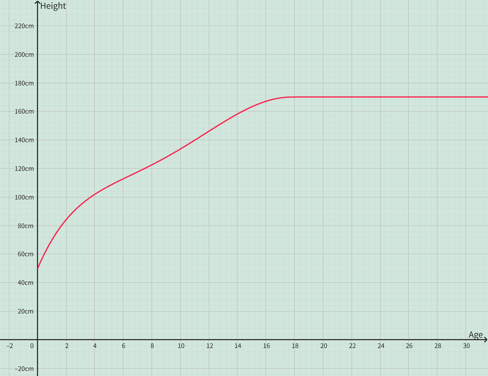

<h4 class="alert-heading">Problem 6</h4>

In this section we discussed examples of ordinary, everyday functions: population is a function of time, postage cost is a function of package weight, water temperature is a function of time. Give three other examples of functions from every-day life that are described verbally. What can you say about the domain and range of each of your functions? If possible, sketch a rough graph of each function.

<h4 class="alert-heading">Solution</h4>

- **Example 1: Human height is a function of age.**

  The domain is the average human lifespan. It's about 86 years. So the domain of the function is $[0, 86]$.

  The codomain is the average human height. The average height of adults is about $170$ cm, and the average height of newborns is about $50$ cm. So the codomain of the function is $[50, 170]$.

  Generally speaking, under normal circumstances, a newborn baby has a body length of about $50$ cm. The first major growth spurt occurs within the first year, reaching about $75$ cm. By the age of 2, they grow to about $85$ cm. From ages 3 to 7, height increases by $6$ to $15$ cm annually. Most people reach about 160 cm by the age of 12. With the onset of adolescence, height increases rapidly again. Growth slows down around age 16 and generally ceases by age 18 when adulthood is reached.

  

- **Example 2: Atmospheric pressure is a function of altitude.**

  The domain is defined as the altitude from sea level to the highest peak in the world, Mount Everest, which is from $0$ to $8848$ m. So the domain of the function is $[0, 8848]$

  The relationship between atmospheric pressure and altitude can be roughly expressed as：**for every $9$ m increase in altitude, the atmospheric pressure decreases by $100$ Pa.**

  The above relationship can be expressed as a function
  $$
  P=P_0 - \frac{a}{90}
  $$
  where $P$ is the current atmospheric pressure, $P_0$ is the standard atmospheric pressure at the sea level ($0 ^\circ C$, $101$ kPa), and $a$ is the altitude. The function graph is as follows:

  

  By observing the above figure, it can be concluded that the codomain is $[2.69, 101]$

  > According to scientific calculation models, the atmospheric pressure at the peak of Mount Everest is approximately $1.925$ kPa, which is equivalent to $1.93%$ of the standard atmospheric pressure at sea level.

- **Example 3: Taxi fare is a function of distance.**

  The taxi fare rules are generally divided into a starting price and a mileage-based price. Taking my city as an example, the price is fixed at $12$ for trips within $10km$. For distances exceeding $10$ km, an additional $1.6$ is charged per kilometer.

  This rule can be expressed as a piecewise function:

  $$
  p(d) = \begin{cases}
      10 \quad & 0 < d\le 10 \\
      10 + (d-10) \cdot 1.6 \quad & d>10
    \end{cases}
  $$

  The function graph is as follows:

  

  So, the domain of the function is $(0, +\infty)$, the codomain is $[10, +\infty)$

