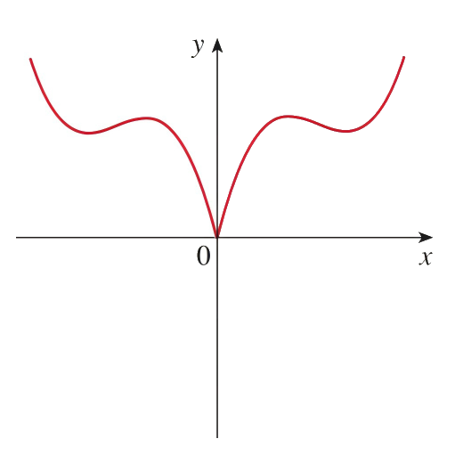
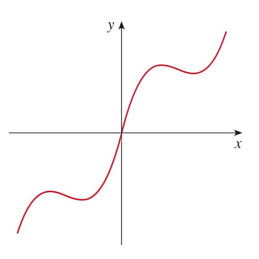
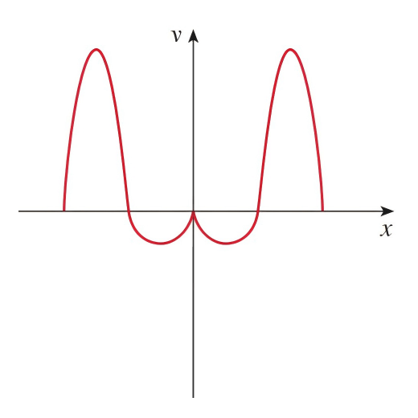
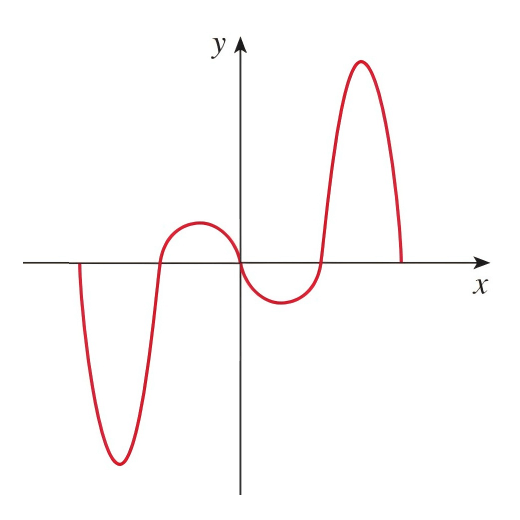

<h4 class="alert-heading">Problem 79-80</h4>

The graph of a function defined for $x \ge 0$ is given. Complete the graph for $x < 0$ to make (a) an even function and (b) an odd function.

<h4 class="alert-heading">Solution</h4>

**Problem 79**

| EVEN FUNCTION           | ODD FUNCTION            |
| :---------------------: | :---------------------: |
|  |  | 

--------

**Problem 80**

| EVEN FUNCTION           | ODD FUNCTION            |
| :---------------------: | :---------------------: |
|  |  | 

