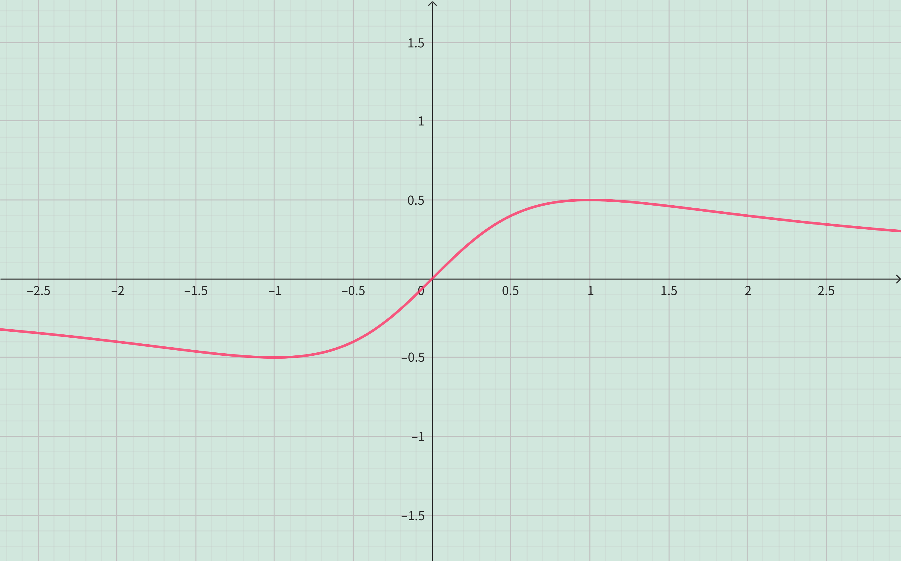
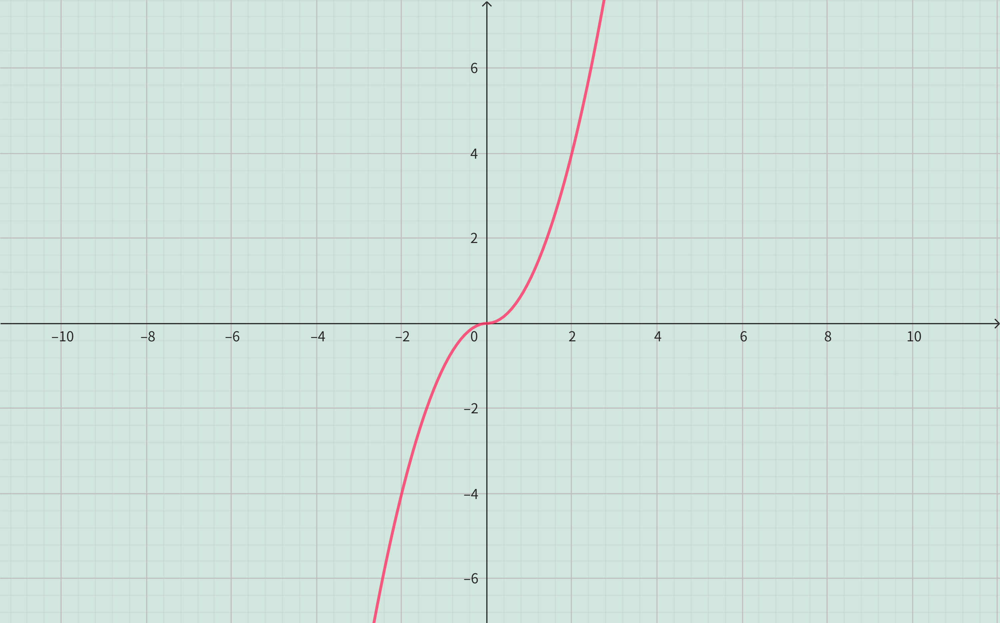

<h4 class="alert-heading">Problem 81-86</h4>

Determine whether f is even, odd, or neither. You may wish to use a graphing calculator or computer to check your answer visually.

81. $\displaystyle f(x) = \frac{x}{x^2+1}$

82. $\displaystyle f(x) = \frac{x^2}{x^4+1}$

83. $\displaystyle f(x) = \frac{x}{x+1}$

84. $\displaystyle f(x) = x|x|$

85. $\displaystyle f(x) = 1+3x^2-x^4$

86. $\displaystyle f(x) = 1+3x^3-x^5$

<h4 class="alert-heading">Solution</h4>

**Problem 81**

<!-- tabs:start -->

#### **Derivation**

$$
\begin{align*}
f(x) &= \frac{x}{x^2+1} \\
f(-x) &= \frac{-x}{(-x)^2+1} = -\frac{x}{x^2+1} = -f(x)
\end{align*}
$$

Therefore, $f(x)$ is an **odd function**.

#### **Graph**

Since the graph of $f$ is symmetric about the origin, so $f(x)$ is an **odd function**.

<!-- tabs:end -->

--------

**Problem 82**

<!-- tabs:start -->

#### **Derivation**

$$
\begin{align*}
f(x) &= \frac{x^2}{x^4+1} \\
f(-x) &= \frac{(-x)^2}{(-x)^4+1} = \frac{x^2}{x^4+1} = f(x)
\end{align*}
$$

Therefore, $f(x)$ is an **even function**.

#### **Graph**

Since the graph of $f$ is symmetric about the y-axis, so $f(x)$ is an **even function**.

<!-- tabs:end -->

--------

**Problem 83**

<!-- tabs:start -->

#### **Derivation**

$$
\begin{align*}
f(x) &= \frac{x}{x+1} \\
f(-x) &= \frac{-x}{-x+1} = \frac{x}{x-1}
\end{align*}
$$

Since $f(-x) \ne f(x)$ and $f(-x) \ne -f(x)$, so $f(x)$ is **nether an even function nor an odd function**.

#### **Graph**

Since the graph of $f$ is nether symmetric about the origin nor the y-axis, so $f(x)$ is **nether an even function nor an odd function**.

<!-- tabs:end -->

--------

**Problem 84**

<!-- tabs:start -->

#### **Derivation**

$$
\begin{align*}
f(x) &= x|x| \\
f(-x) &= -x|-x| = -x|x| = -f(x)
\end{align*}
$$

Therefore, $f(x)$ is an **odd function**.

#### **Graph**

Since the graph of $f$ is symmetric about the origin, so $f(x)$ is an **odd function**.

<!-- tabs:end -->

--------

**Problem 85**

<!-- tabs:start -->

#### **Derivation**

$$
\begin{align*}
f(x) &= 1+3x^2-x^4 \\
f(-x) &= 1+3(-x)^2-(-x)^4 = 1+3x^2-x^4 = f(x)
\end{align*}
$$

Therefore, $f(x)$ is an **even function**.

#### **Graph**

Since the graph of $f$ is symmetric about the y-axis, so $f(x)$ is an **even function**.

<!-- tabs:end -->

--------

**Problem 86**

<!-- tabs:start -->

#### **Derivation**

$$
\begin{align*}
f(x) &= 1+3x^3-x^5 \\
f(-x) &= 1+3(-x)^3-(-x)^5 = 1-3x^2+x^5
\end{align*}
$$

Since $f(-x) \ne f(x)$ and $f(-x) \ne -f(x)$, so $f(x)$ is nether an **even function nor an odd function**.

#### **Graph**

Since the graph of $f$ is nether symmetric about the origin nor the y-axis, so $f(x)$ is **nether an even function nor an odd function**.

<!-- tabs:end -->

