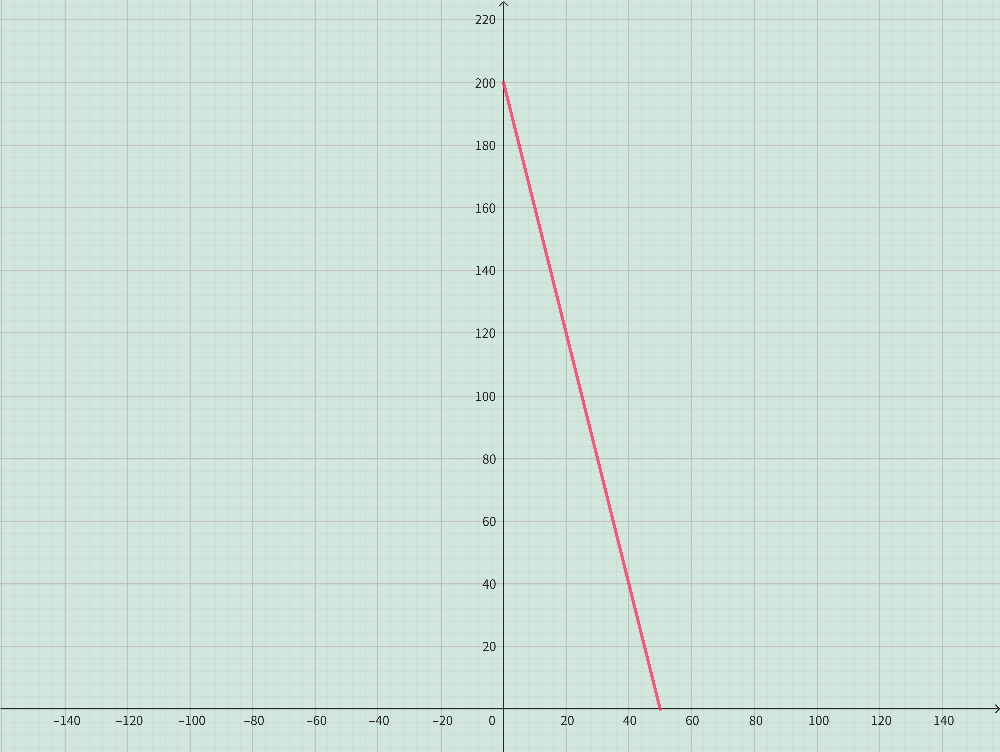

<h4 class="alert-heading">Problem 16</h4>

The manager of a weekend flea market knows from past experience that if he charges $x$ dollars for a rental space at
the market, then the number $y$ of spaces that will be rented is given by the equation $y = 200 - 4x$.

1. Sketch a graph of this linear function. (Remember that the rental charge per space and the number of spaces rented can't be negative quantities.)

2. What do the slope, the $y$-intercept, and the $x$-intercept of the graph represent?

<h4 class="alert-heading">Solution</h4>

1. 

2. The slope is $-4$, which indicates that for every additional dollar charged, $4$ fewer spaces are rented out.

    The $y$-intercept is $200$, which represents the number of spaces rented when the fee is $0$. It can be interpreted as the total number of rental space available.

    The $x$-intercept is $50$, which represents that when the fee reaches or exceeds this threshold value $50$, no spaces will be rented.

