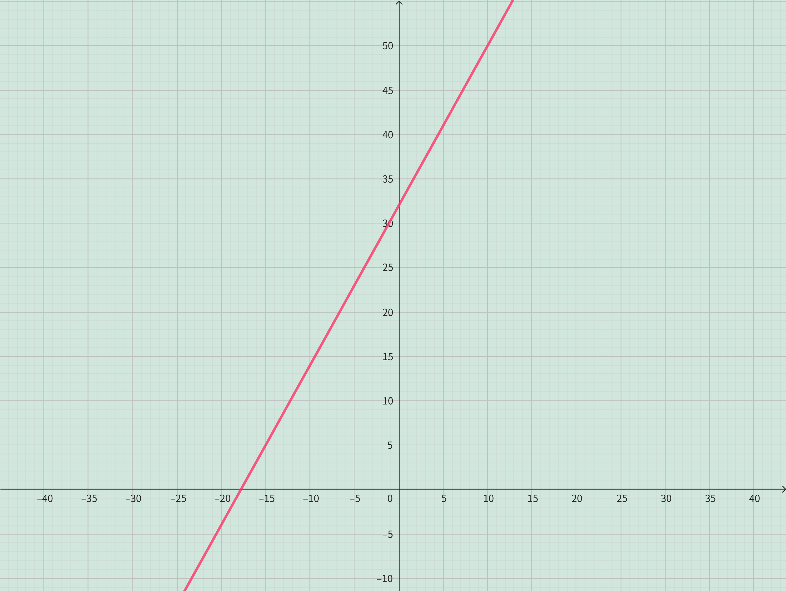

<h4 class="alert-heading">Problem 17</h4>

The relationship between the Fahrenheit ($F$) and Celsius ($C$) temperature scales is given by the linear function $F = \frac{9}{5}C + 32$.

1. Sketch a graph of this function.

2. What is the slope of the graph and what does it represent? What is the $F$-intercept and what does it represent?

<h4 class="alert-heading">Solution</h4>

1. 

2. The slope is $\frac{9}{5}$, which indicates the change in Fahrenheit temperature for every one-degree increase in Celsius temperature.

    The $F$-intercept is $32$, which represents the Fahrenheit temperature when the Celsius temperature is $0 \degree$. 

