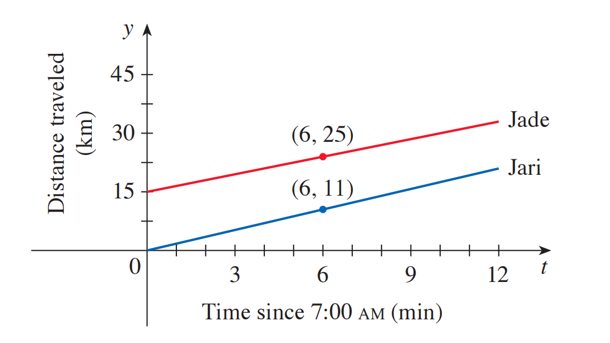

<h4 class="alert-heading">Problem 18</h4>

Jade and her roommate Jari commute to work each morning, traveling west on I-10. One morning Jade left for work at 6:50 am, but Jari left 10 minutes later. Both drove at a constant speed. The graphs show the distance (in kilometers) each of them has traveled on I-10, $t$ minutes after 7:00 am.

1. Use the graph to decide which driver is traveling faster.

2. Find the speed (in km/h) at which each of them is driving.

3. Find linear functions $f$ and $g$ that model the distances traveled by Jade and Jari as functions of $t$ (in minutes).

<h4 class="alert-heading">Solution</h4>

1. Jari is faster. 

    Intuitively, the slope of the line representing Jari is greater. Since the slope represents velocity, Jari is faster. 

2. Specifically, the slope of the line representing Jari is $\frac{11}{6}$, while the slope of the line representing Jade is $\frac{25-15}{6} = \frac{10}{6}$. 

    Therefore, the speed of Jari is $\frac{11}{6}$ km/min = $110$ km/h; the speed of Jade is $\frac{10}{6}$ km/min = $100$ km/h.

3. - Jade $f(t) = \frac{5}{3}t+15$

    - Jari $g(t) = \frac{11}{6}t$

