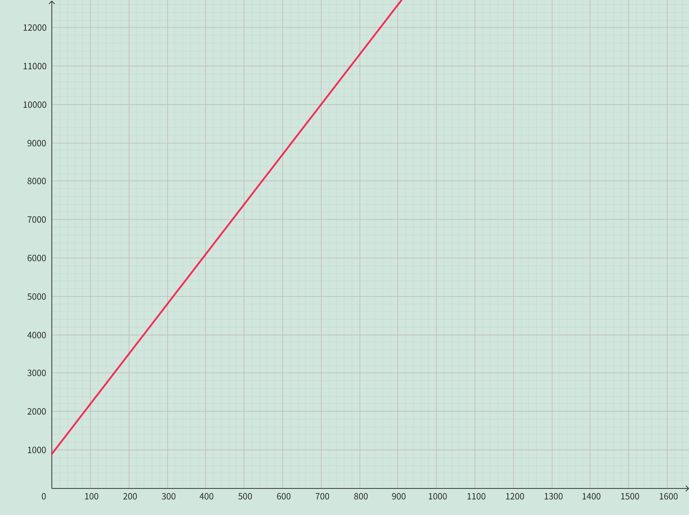

<h4 class="alert-heading">Problem 19</h4>

The manager of a furniture factory finds that it costs $\$2200$ to manufacture $100$ chairs in one day and $\$4800$ to produce $300$ chairs in one day.

1. Express the cost as a function of the number of chairs produced, assuming that it is linear. Then sketch the graph.

2. What is the slope of the graph and what does it represent?

3. What is the $y$-intercept of the graph and what does it represent?

<h4 class="alert-heading">Solution</h4>

1. Let the linear function is $y = ax + b$, then the slope $a$ is

    $$
    a = \frac{4800-2200}{300-100} = \frac{2600}{200} = 13
    $$

    Substitute $x=100, y=2200$ into the equation $y=13x+b$ and solve for $b=900$.

    Therefore, the function is $y = 13x+900$.

    

2. The slope is $13$, which indicates that for each additional chair produced, the cost increases by $\$13$.

3. The $y$-intercept is $900$, which represents the fixed cost, that is the cost incurred even if nothing is produced.

