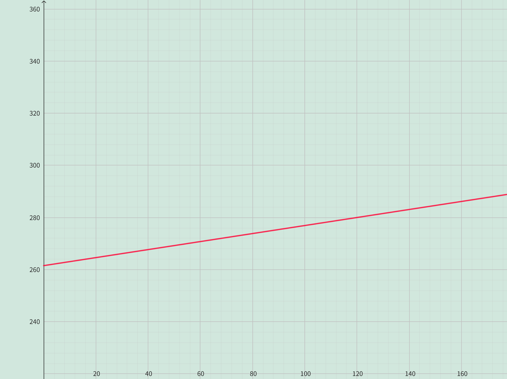

<h4 class="alert-heading">Problem 20</h4>

The monthly cost of driving a car depends on the number of kilometers driven. Lynn found that in May it cost her $\$380$ to drive $770$ km and in June it cost her $\$460$ to drive $1290$ km.

1. Express the monthly cost $C$ as a function of the distance driven $d$, assuming that a linear relationship gives a suitable model.

2. Use part (1) to predict the cost of driving $2400$ km per month.

3. Draw the graph of the linear function. What does the slope represent?

4. What does the $C$-intercept represent?

5. Why does a linear function give a suitable model in this situation?

<h4 class="alert-heading">Solution</h4>

1. The costs generally exhibit a linear relationship with driving distance. Let the linear function is $C = ad + b$, then the slope $a$ is

    $$
    a = \frac{460-380}{1290-770} = \frac{2}{13}
    $$

    Substitute $d=770, C=380$ into the equation $C=\frac{2}{13}d+b$ and solve for $b=\frac{3400}{13}$.

    Therefore, the function is $\displaystyle C = \frac{2}{13}d+\frac{3400}{13}$.

2. Substitute $d=2400$ into $\displaystyle C=\frac{2}{13}d+\frac{3400}{13}$ yields:

    $$ C = \frac{2}{13} \cdot 2400 + \frac{3400}{13} = \frac{8200}{13} \approx 630.77$$

    Therefore, the cost of driving $2400$ km per month is $\$630.77$.

3. According to part (1), we got the linear function is 

    $$C = \frac{2}{13}d+\frac{3400}{13}$$

    Its graph is as the follow:

    

4. The $C$-intercept represent the monthly cost even if the car does not run. It can be understood as fixed cost or foundation maintenance cost.

5. The car cost is generally composed of fixed maintenance cost and floating use cost, and the fixed maintenance cost is generally a fixed constant; The use cost is mainly reflected in the fuel cost, which is linear with the mileage. Therefore, the linear model is applicable in this situation.

