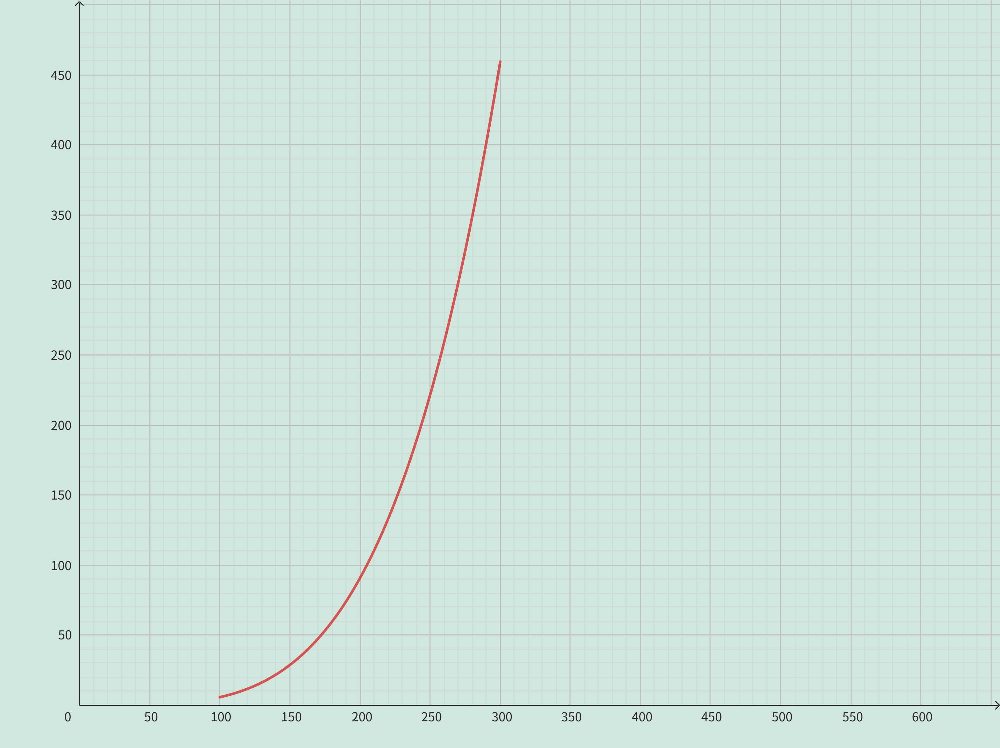

<h4 class="alert-heading">Problem 26</h4>

Astronomers infer the radiant exitance (radiant flux emitted per unit area) of stars using the Stefan Boltzmann Law:
$$
E(T) = (5.67 \times 10^{-8})T^4
$$
where $E$ is the energy radiated per unit of surface area measured in watts (W) and $T$ is the absolute temperature measured in kelvins (K).

1. Graph the function $E$ for temperatures $T$ between $100$ K and $300$ K.

2. Use the graph to describe the change in energy $E$ as the temperature $T$ increases.

<h4 class="alert-heading">Solution</h4>

1. 

2. Accroding to the Stefan Boltzmann Law, the relationship between energy $E$ and temperature $T$ is **quartic**. That is, when the temperature $T$ doubled, the energy $E$ increased $2^4 = 16$ times.

