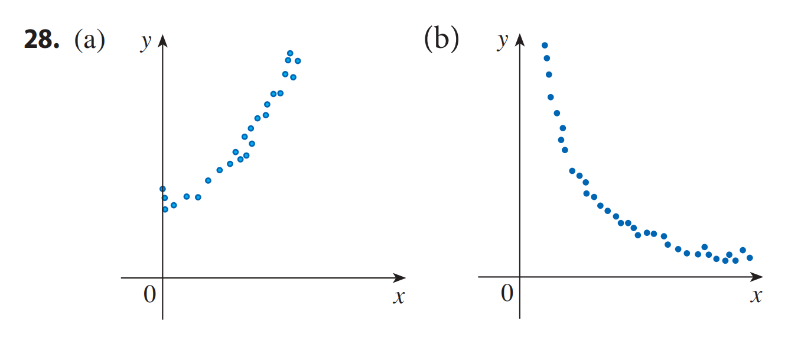

<h4 class="alert-heading">Problem 28</h4>

For each scatter plot, decide what type of function you might choose as a model for the data. Explain your choices.

<h4 class="alert-heading">Solution</h4>

