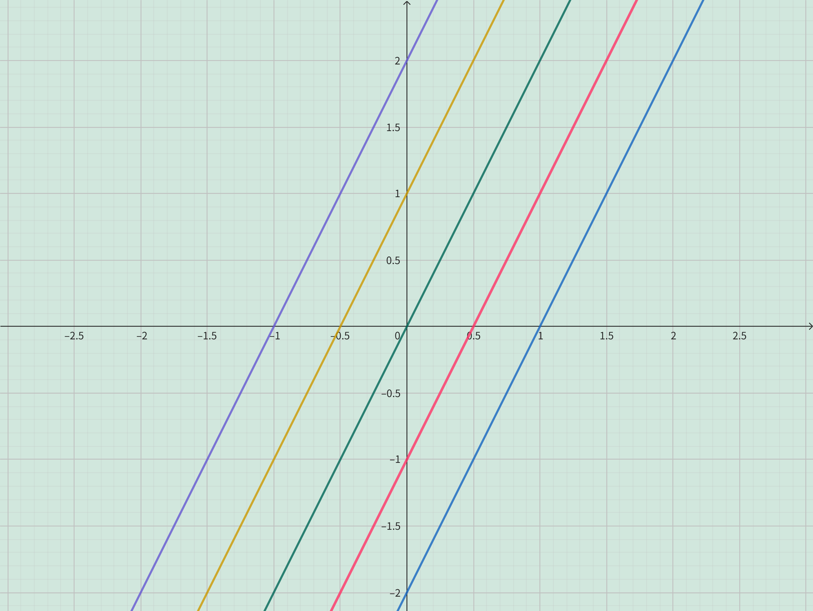
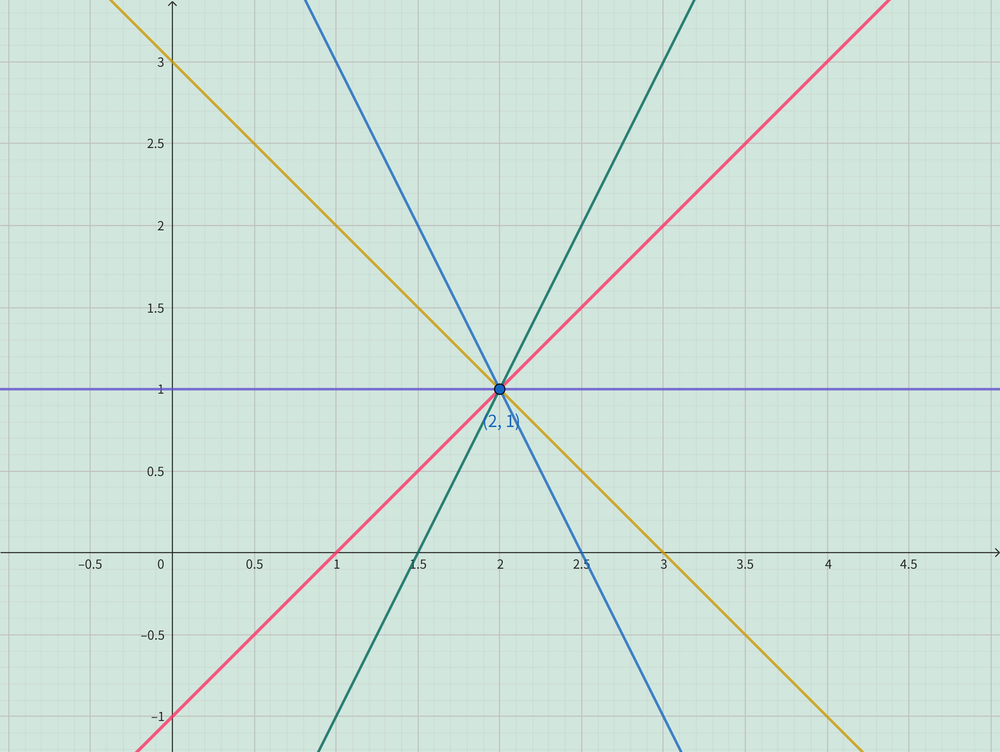

<h4 class="alert-heading">Problem 7</h4>

1. Find an equation for the family of linear functions with slope $2$ and sketch several members of the family.

2. Find an equation for the family of linear functions such that $f(2) = 1$. Sketch several members of the family.

3. Which function belongs to both families?

<h4 class="alert-heading">Solution</h4>

1. The general equation of a linear functions with slope $2$ is $$y = 2x+b$$
    The images of the family of this function is a group of parallel lines with slope $2$, as shown in the following figures:

    

2. From $f(2)=1$, we can see that the point $(2,1)$ lies on the line. Substituting $x=2, y=1$ into the Point-slope form equation $y-y_0=a(x-x_0)$ yields:

    $$
    \begin{align*}
    y-1 &= a(x-2) \\
    y &= ax-2a+1 \\
    \end{align*}
    $$

    The line rotates about the point $(2,1)$, and the images of the family of this functions are as follows: 

    

3. This question can be approached in 2 ways.

<!-- tabs:start -->

#### **Solution 1**

Based on the 1st question, adding the 2nd question's condition that the line passes through the point $(2, 1)$.

That is, find the line through the point $(2, 1)$ from all lines with a slope of $2$. 

Substitute $x=2, y=1$ into the equation $y=2x+b$ and solve for $b=-3$.

Therefore, the function that belongs to both families is $y = 2x-3$.

#### **Solution 2**

Based on the 2nd question, adding the 1st question's condition of slope $2$.

That is, find the line with a slope of $2$ from all lines throuth the point $(2, 1)$. 

Simply substitute the slope $a=2$ into the equation $y = ax-2a+1$, thus obtaining the line equation $y=2x-3$.

Therefore, the function that belongs to both families is $y = 2x-3$.

<!-- tabs:end -->

