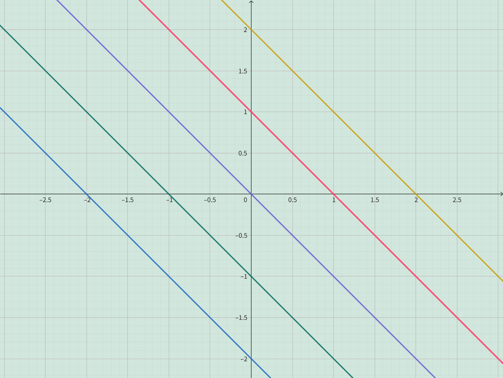

<h4 class="alert-heading">Problem 9</h4>

What do all members of the family of linear functions $f(x) = c - x$ have in common? Sketch several members of the family.

<h4 class="alert-heading">Solution</h4>

All members of the family of linear functions $f(x) = c - x$ have the same slope $-1$.

