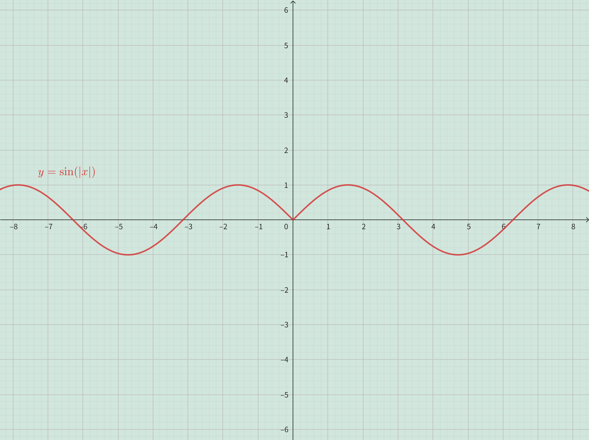
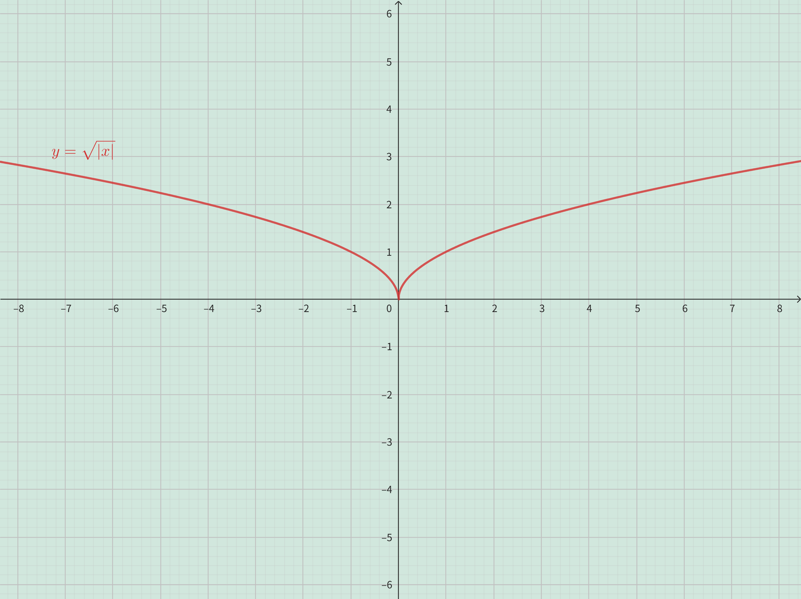

<h4 class="alert-heading">Problem 31</h4>

1. How is the graph of $y = f(| x |)$ related to the graph of $f$ ?
2. Sketch the graph of $y = \sin | x |$.
3. Sketch the graph of $y = \sqrt{| x |}$.

<h4 class="alert-heading">Solution</h4>

1. Because $|-x| = |x| = x$, 
    - for the positive half x-axis (include the origin): the graph of $y = f(| x |)$ is as the same as the graph of $f$.
    - for the negative half x-axis: the graph of $y = f(| x |)$ is as the same as the graph of $f$ reflected about the y-axis.

| 2. the graph of $y = \sin \vert x \vert$ | 3. the graph of $y = \sqrt{\vert x \vert}$ |
| ---------------------------------------- | ------------------------------------------ |
|                 |                   |

