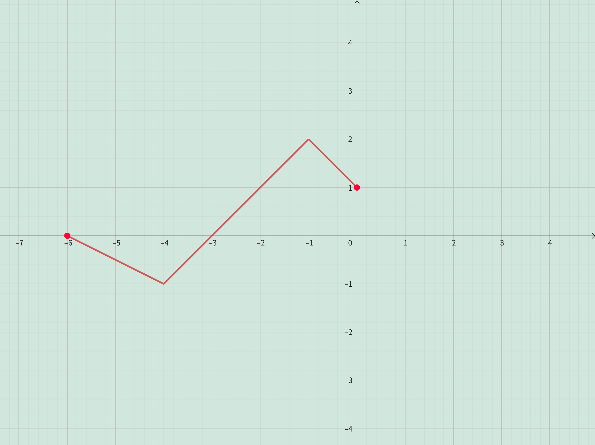

<h4 class="alert-heading">Problem 5</h4>

The graph of $f$ is given. Use it to graph the following functions.

1. $y = f(2x)$

2. $y = f(\frac{1}{2} x)$

3. $y = f(-x)$

4. $y = -f(-x)$

<h4 class="alert-heading">Solution</h4>

| 1. $y = f(2x)$          | 2. $y = f(\frac{1}{2} x)$ |
| ----------------------- | ------------------------- |
|  |    | 

| 3. $y = f(-x)$            | 4. $y = -f(-x)$         |
| ------------------------- | ----------------------- |
|    |  | 

