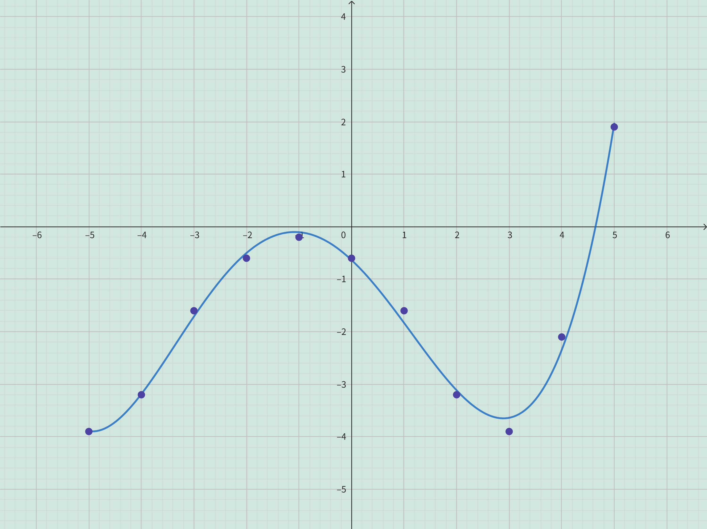

<h4 class="alert-heading">Problem 58</h4>

Use the given graphs of $f$ and $g$ to estimate the value of $f(g(x))$ for $x = -5, -4, -3, \dots , 5$. Use these estimates to sketch a rough graph of $f \circ g$.

<h4 class="alert-heading">Solution</h4>

<table>
<tr>
<td>

| $x$ | $g(x)$ | $f(g(x))$ |
| --- | ------ | --------- |
| -5  | -0.2   | -3.9      |
| -4  |  1.1   | -3.3      |
| -3  |  2.2   | -1.6      |
| -2  |  2.8   | -0.6      |
| -1  |    3   | -0.2      |
|  0  |  2.8   | -0.6      |
|  1  |  2.2   | -1.6      |
|  2  |  1.1   | -3.3      |
|  3  | -0.2   | -3.9      |
|  4  |   -2   | -2.1      |
|  5  | -4.1   |  1.9      |

</td>
<td>

</td>
</tr>
</table>

