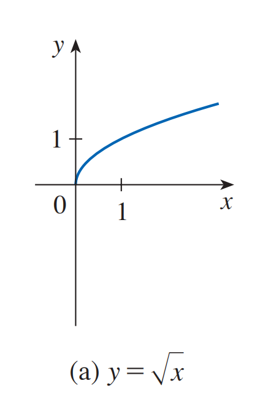
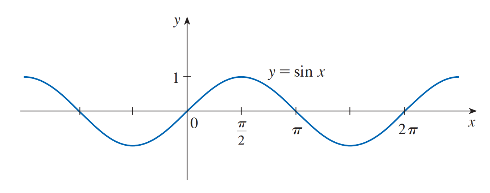

<h4 class="alert-heading">Problem 8</h4>

1. How is the graph of $y = 1 + \sqrt{x}$ related to the graph of $y = \sqrt{x}$? Use your answer and Figure 4(a) to sketch the graph of $y = 1 + \sqrt{x}$.

2. How is the graph of $y = 5 \sin \pi x$ related to the graph of $y = \sin x$ ? Use your answer and Figure 6 to sketch the graph of $y = 5 \sin \pi x$ .

| Figure 4(a) | Figure 6 |
| ----------- | -------- |
|  |  |

<h4 class="alert-heading">Solution</h4>

