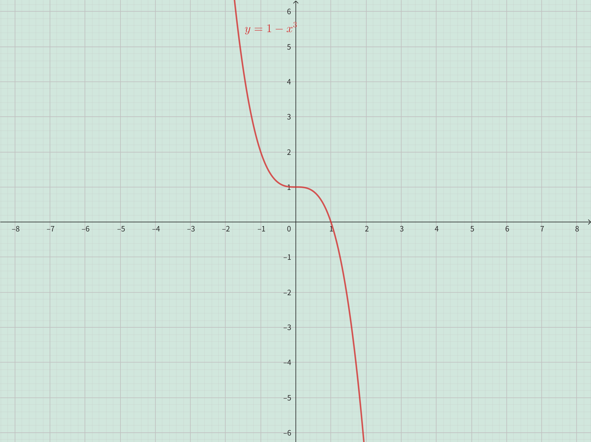
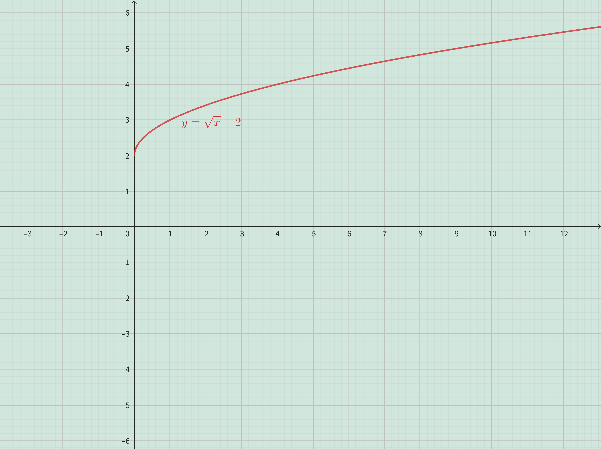

<h4 class="alert-heading">Problem 9-26</h4>

Graph the function by hand, not by plotting points, but by starting with the graph of one of the standard functions given in Table 1.2.3, and then applying the appropriate transformations.

9.  $\displaystyle y = 1 + x^2$

10. $\displaystyle y = (x + 1)^2$

11. $\displaystyle y = | x + 2 |$ 

12. $\displaystyle y = 1 - x^3$

13. $\displaystyle y = \frac{1}{x} + 2$ 

14. $\displaystyle y = -\sqrt{x} - 1$

15. $\displaystyle y = \sin 4x$ 

16. $\displaystyle y = 1 +\frac{1}{x^2}$

17. $\displaystyle y = 2 + \sqrt{x + 1}$ 

18. $\displaystyle y = -(x - 1)^2 + 3$

19. $\displaystyle y = x^2 - 2x + 5$ 

20. $\displaystyle y = (x + 1)^3 + 2$

21. $\displaystyle y = 2 - | x |$ 

22. $\displaystyle y = 2 - 2 \cos x$

23. $\displaystyle y = 3 \sin \frac{1}{2} x + 1$

24. $\displaystyle y = \frac{1}{4} \tan \Big(x - \frac{\pi}{4}\Big)$

25. $\displaystyle y = | \cos \pi x |$ 

26. $\displaystyle y = | \sqrt{x} - 1 |$

<h4 class="alert-heading">Solution</h4>

**Problem 9**

The graph of $y = 1 + x^2$ can be obtained from the graph of $y = x^2$ by shifting $1$ unit upward. 

| $y = x^2$                 |                              | $y = 1 + x^2$               |
| ------------------------- | :--------------------------: | --------------------------- |
|  |  $\uparrow 1 \\ \implies$    |    | 

----

**Problem 10**

The graph of $y = (x + 1)^2$ can be obtained from the graph of $y = x^2$ by shifting $1$ unit to the left. 

| $y = x^2$                 |                                | $y = (x + 1)^2$             |
| ------------------------- | :----------------------------: | --------------------------- |
|  |  $\leftarrow 1 \\ \implies$    |    |

----

**Problem 11**

The graph of $y = | x + 2 |$ can be obtained from the graph of $y = | x |$ by shifting $2$ unit to the left. 

| $y = \vert x \vert$       |                                | $y = \vert x + 2 \vert$     |
| ------------------------- | :----------------------------: | --------------------------- |
|  |  $\leftarrow 2 \\ \implies$    |    |

----

**Problem 12**

The graph of $y = 1 - x^3$ can be obtained from the graph of $y = x^3$ by shifting $1$ unit upword and reflecting about the $y$-axis. 

| $y = x^3$                 |                              | $y = 1+x^3$               |        | $y = 1-x^3$ |
| ------------------------- | :--------------------------: | ------------------------- | :----: | ----------- |
|  |  $\uparrow 1 \\ \implies$    |  | $\leftrightharpoons \\ \implies$ |  |

----

**Problem 13**

The graph of $y = \frac{1}{x} + 2$ can be obtained from the graph of $y = \frac{1}{x}$ by shifting $2$ unit upward. 

| $y = \frac{1}{x}$         |                              | $y = \frac{1}{x} + 2$       |
| ------------------------- | :--------------------------: | --------------------------- |
|  |  $\uparrow 2 \\ \implies$    |    | 

----

**Problem 14**

The graph of $y = -\sqrt{x} - 1$ can be obtained from the graph of $y = \sqrt{x}$ by reflecting about the $x$-axis and then shifting $1$ unit downword. 

| $y = \sqrt{x}$            |                              | $y = -\sqrt{x}$           |        | $y = -\sqrt{x}-1$ |
| ------------------------- | :--------------------------: | ------------------------- | :----: | ----------- |
|  |  $\downharpoonleft\upharpoonright \\ \implies$  |  | $\downarrow 1 \\ \implies$ |  |

----

**Problem 15**

The graph of $y = \sin 4x$ can be obtained from the graph of $y = \sin x$ by shifting $2$ unit upward. 

| $y = \sin x$              |                              | $y = \sin 4x$               |
| ------------------------- | :--------------------------: | --------------------------- |
|  |  $\small{\rightarrow 4 \leftarrow}\\ \implies$    |    | 

----

**Problem 16**

The graph of $y = 1 +\frac{1}{x^2}$ can be obtained from the graph of $y = \frac{1}{x^2}$ by shifting $1$ unit upward. 

| $y = \frac{1}{x^2}$       |                              | $y = 1 +\frac{1}{x^2}$      |
| ------------------------- | :--------------------------: | --------------------------- |
|  |  $\uparrow 1 \\ \implies$    |    | 

----

**Problem 17**

The graph of $y = 2 + \sqrt{x + 1}$ can be obtained from the graph of $y = \sqrt{x}$ by shifting $2$ unit upward and shifting $1$ unit to the left. 

| $y = \sqrt{x}$            |                             | $y = 2+\sqrt{x}$            |       | $y = 2+\sqrt{x+1}$ |
| ------------------------- | :-------------------------: | --------------------------- | :----: |----------- |
|  |  $\uparrow 2\\ \implies$    |    | $\leftarrow 1\\ \implies$   |    |

----

**Problem 18**

The graph of $y = -(x - 1)^2 + 3$ can be obtained from the graph of $y = x^2$ by 
1. Shifting $1$ unit to the right
2. Reflecting about the $x$-axis
3. Shifting $3$ unit upward

| $y = x^2$                 |                              | $y = (x-1)^2$               |
| ------------------------- | :--------------------------: | :-------------------------: |
|  |  $\rightarrow 1 \\ \implies$ |    | 
|                           |                              | $\downharpoonleft\upharpoonright$ |
|  |  $\uparrow 3 \\ \impliedby$  |    | 
| $y = -(x-1)^2+3$          |                              | $y = -(x-1)^2$              |

----

**Problem 19**

$$
\begin{aligned}
 y &= x^2 - 2x + 5 \\ 
 &= (x^2-2x+1)+4 \\
 &= (x-1)^2+4
\end{aligned}
$$

Therefore, the graph of $y = x^2 - 2x + 5$ can be obtained from the graph of $y = x^2$ by shifting $1$ unit to the rightand shifting $4$ unit upward.

| $y = \sqrt{x}$            |                             | $y = (x-1)^2$               |       | $y = (x-1)^2+4$ |
| ------------------------- | :-------------------------: | --------------------------- | :----: |----------- |
|  |  $\rightarrow 1\\ \implies$ |    | $\uparrow 4\\ \implies$     |    |

----

**Problem 20**

The graph of $y = (x + 1)^3 + 2$ can be obtained from the graph of $y = x^3$ by shifting $1$ unit to the left and shifting $2$ unit upword. 

| $y = x^3$                 |                              | $y = (x+1)^3$             |        | $y = (x+1)^3+2$ |
| ------------------------- | :--------------------------: | ------------------------- | :----: | ----------- |
|  |  $\leftarrow 1 \\ \implies$    |  | $\uparrow 2 \\ \implies$    |  |

----

**Problem 21**

The graph of $y = 2 - | x |$ can be obtained from the graph of $y = |x|$ by reflecting about the $x$-axis and shifting $2$ unit upword. 

| $y = \vert x \vert$       |                              | $y = -\vert x \vert$      |        | $y = 2-\vert x \vert$ |
| ------------------------- | :--------------------------: | ------------------------- | :----: | ----------- |
|  |  $\downharpoonleft\upharpoonright \\ \implies$    |  | $\uparrow 2 \\ \implies$    |  |

----

**Problem 22**

The graph of $y = 2 - 2 \cos x$ can be obtained from the graph of $y = \cos x$ by 
1. Stretch vertically by a factor of $2$.
2. Reflecting about the $x$-axis
3. Shifting $2$ unit upward

| $y = \cos x$              |                              | $y = 2 \cos x$              |
| ------------------------- | :--------------------------: | :-------------------------: |
|  | $\updownarrow 2 \\ \implies$ |    | 
|                           |                              | $\downharpoonleft\upharpoonright$ |
|  | $\uparrow 2 \\ \impliedby$   |    | 
| $y = 2 - 2 \cos x$        |                              | $y = -2 \cos x$             |

----

**Problem 23**

The graph of $y = 3 \sin \frac{1}{2} x + 1$ can be obtained from the graph of $y = \sin x$ by 
1. Stretch horizontally by a factor of $2$.
2. Stretch vertically by a factor of $3$.
3. Shifting $1$ unit upward

| $y = \sin x$              |                              | $y = \sin \frac{1}{2}x$     |
| ------------------------- | :--------------------------: | :-------------------------: |
|  | $\small{\leftarrow 2 \rightarrow} \\ \implies$ |    | 
|                           |                              | $\updownarrow 3$            |
|  | $\uparrow 1 \\ \impliedby$   |    | 
| $y=3\sin \frac{1}{2} x+1$ |                              | $y=3 \sin \frac{1}{2} x $   |

----

**Problem 24**

The graph of $y = \frac{1}{4} \tan \Big(x - \frac{\pi}{4}\Big)$ can be obtained from the graph of $y = \tan x$ by shifting $\frac{\pi}{4}$ unit to the right and shrinking vertically by a factor of $4$. 

| $y = \tan x$              |                              | $y = \tan \Big(x - \frac{\pi}{4}\Big)$ |        | $y = \frac{1}{4} \tan \Big(x - \frac{\pi}{4}\Big)$ |
| ------------------------- | :--------------------------: | ------------------------- | :----: | ----------- |
|  |  $\rightarrow \frac{\pi}{4} \\ \implies$    |  | $_\uparrow^\downarrow 4 \\ \implies$    |  |

----

**Problem 25**

The graph of $y = | \cos \pi x |$ can be obtained from the graph of $y = \cos x$ by shrinking horizontally by a factor of $\pi$ and then reflecting the graph below the $x$-axis about the $x$-axis. 

| $y = \cos x$              |                              | $y = \cos \pi x$          |        | $y = \vert \cos \pi x \vert$ |
| ------------------------- | :--------------------------: | ------------------------- | :----: | ----------- |
|  |  $\small{\rightarrow \pi \leftarrow} \\ \implies$    |  | $ \upharpoonleft \\ \implies$    |  |

----

**Problem 26**

The graph of $y = | \sqrt{x} - 1 |$ can be obtained from the graph of $y = \sqrt{x}$ by shifting $1$ unit downward and then reflecting the graph below the $x$-axis about the $x$-axis. 

| $y = \sqrt{x}$            |                              | $y = \sqrt{x} - 1$        |        | $y = \vert \sqrt{x} - 1 \vert$ |
| ------------------------- | :--------------------------: | ------------------------- | :----: | ----------- |
|  |  $\downarrow 1 \\ \implies$  |  | $ \upharpoonleft \\ \implies$ |     |

----

