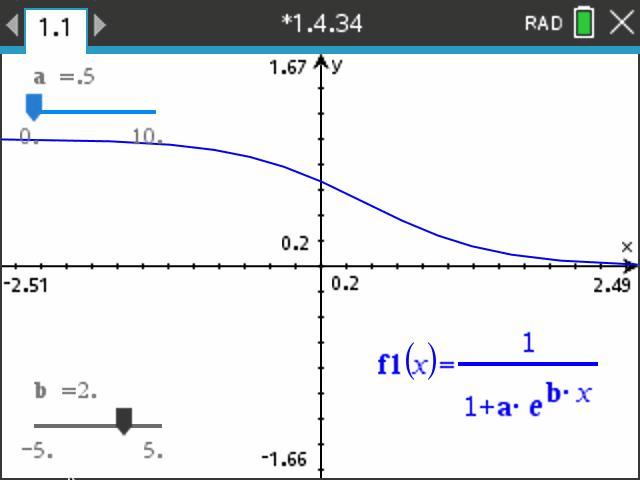

<h4 class="alert-heading">📈 Problem 34</h4>

Graph several members of the family of functions

$$
f(x) = \frac{1}{1+ae^{bx}}
$$

where $a > 0$. How does the graph change when $b$ changes? How does it change when $a$ changes?

<h4 class="alert-heading">Solution</h4>

| $b=-2$                      | $b=2$                       |
| :-------------------------: | :-------------------------: |
|  |  |

