

<h4 class="alert-heading">Problem 9-14</h4>

Make a rough sketch by hand of the graph of the function. Use the graphs given in Figures 3 and 15 and, if necessary, the transformations of Section 1.3.

9. $g(x) = 3^x+1$

10. $h(x) = 2(\frac{1}{2})^x - 3$

11. $y = -e^{-x}$

12. $y = 4^{x+2}$

13. $y = 1 - \frac{1}{2}e^{-x}$

14. $y = e^{|x|}$

<h4 class="alert-heading">Solution</h4>

**Problem 9**

The graph of $y = 3^x+1$ can be obtained from the graph of $y = 3^x$ by shifting $1$ unit upward. 

| $y = 3^x$                 |                              | $y = 3^x + 1$               |
| ------------------------- | :--------------------------: | --------------------------- |
|   |  $\uparrow 1 \\ \implies$    | 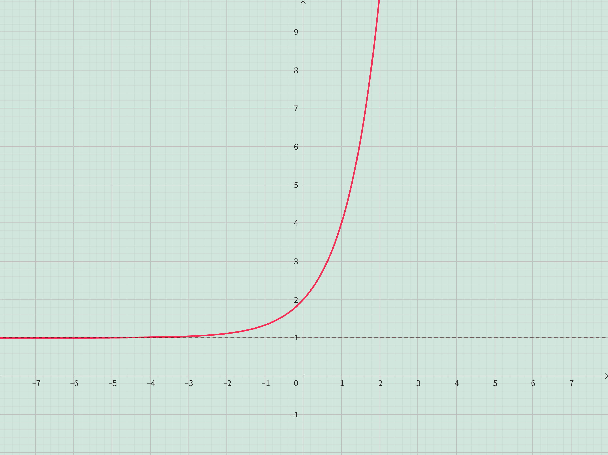    | 

----

**Problem 10**

The graph of $y = 2(\frac{1}{2})^x - 3$ can be obtained from the graph of $y = (\frac{1}{2})^x$ by stretch vertically by a factor of $2$ and then shifting $3$ unit downward.

| $y = (\frac{1}{2})^x$     |                              | $y = 2(\frac{1}{2})^x$    |        | $y = 2(\frac{1}{2})^x - 3$        |
| ------------------------- | :--------------------------: | ------------------------- | :----: | ----------- |
| 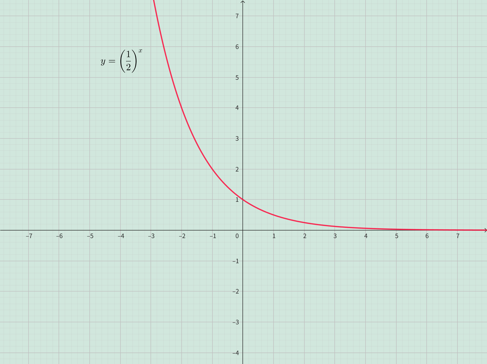 |  $\updownarrow 2  \\ \implies$  | 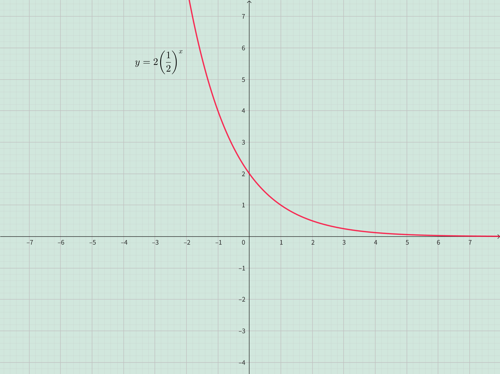 | $ \downarrow 3 \\ \implies$ | 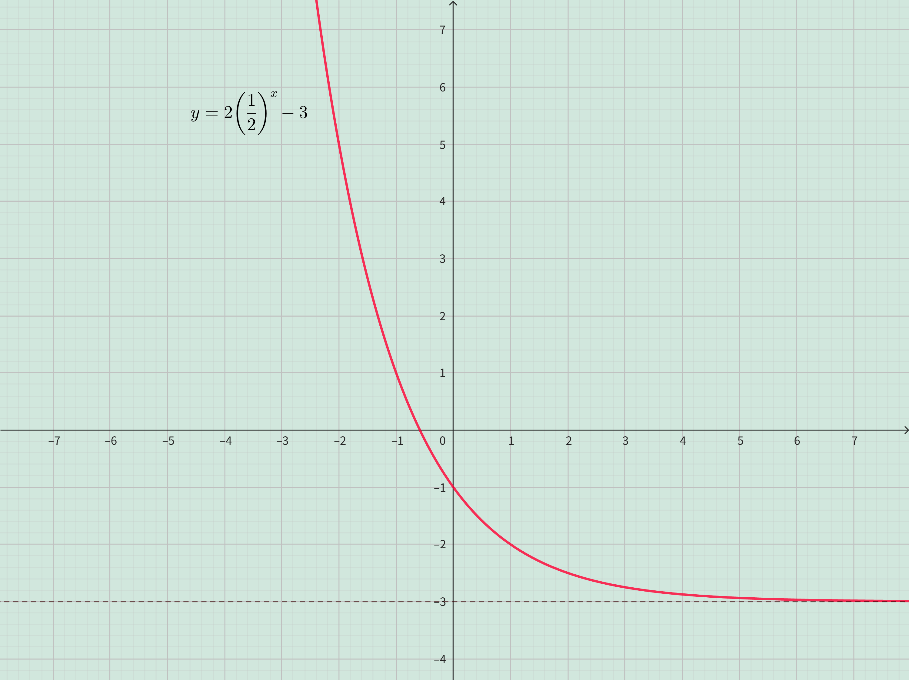    |

----

**Problem 11**

The graph of $y = -e^{-x}$ can be obtained from the graph of $y = e^{x}$ by reflecting about the $y$-axis and then reflecting about the $x$-axis.

| $y = e^x$     |                              | $y = e^{-x}$    |        | $y = -e^{-x}$        |
| ------------------------- | :--------------------------: | ------------------------- | :----: | ----------- |
| 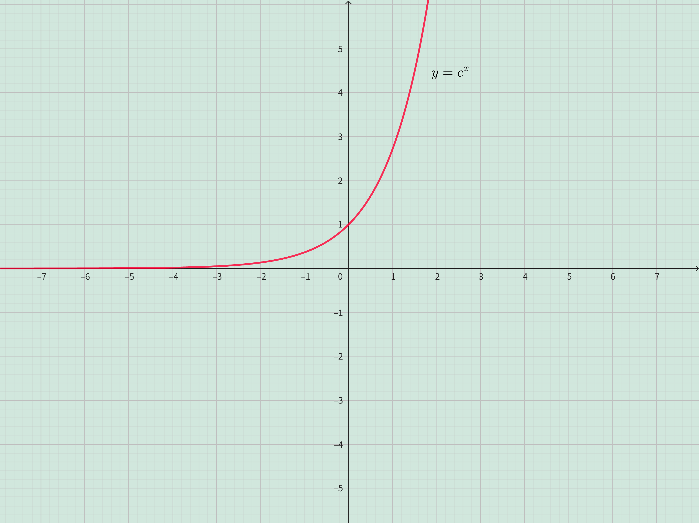 |  $\leftrightharpoons \\ \implies$  | 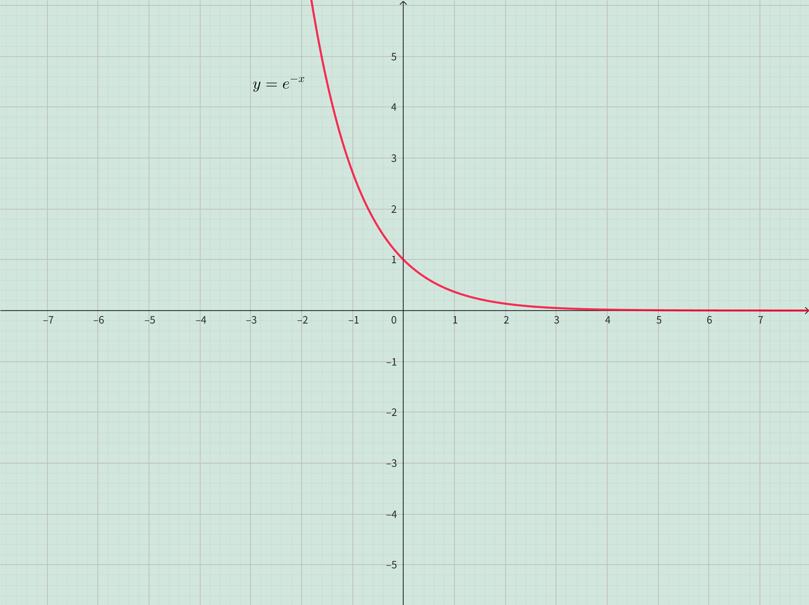 | $ \downharpoonleft\upharpoonright \\ \implies$ | 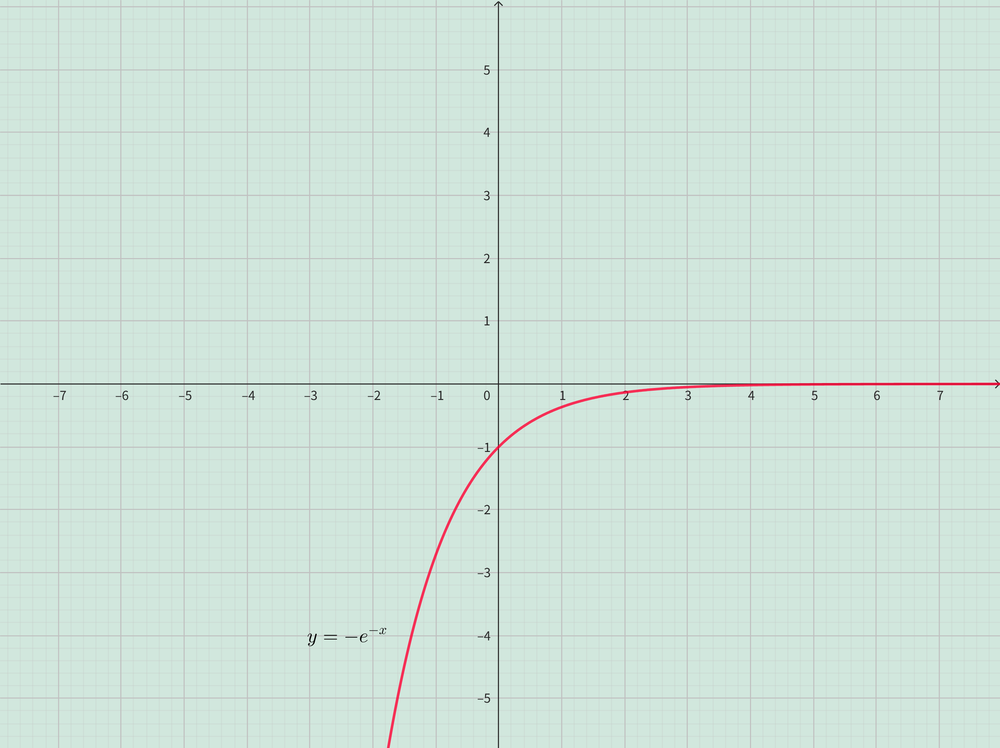    |

----

**Problem 12**

The graph of $y = 4^{x+2}$ can be obtained from the graph of $y = 4^x$ by shifting $2$ unit to the left. 

| $y = 4^x$                 |                              | $y = 4^{x+2}$               |
| ------------------------- | :--------------------------: | --------------------------- |
| 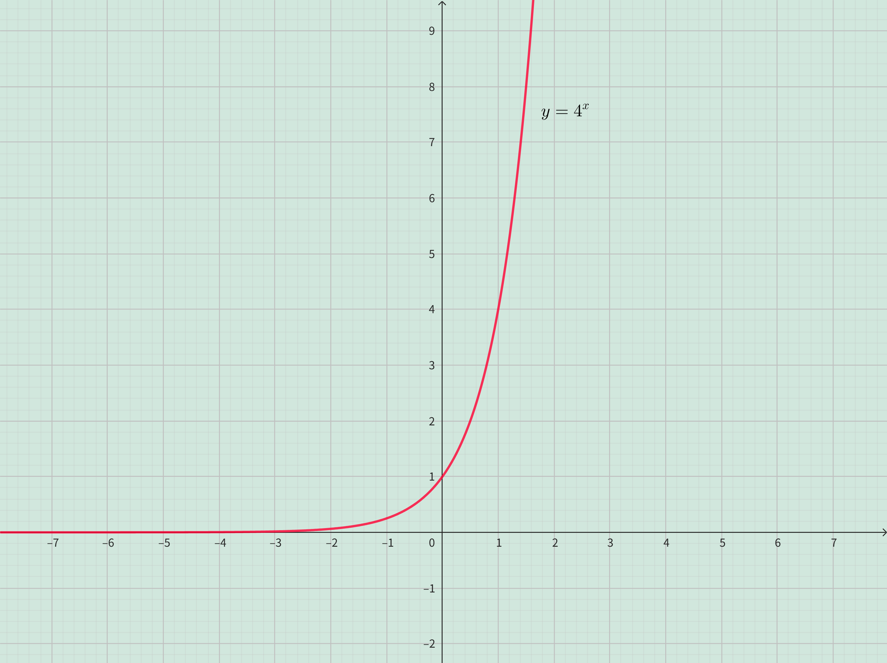 |  $\uparrow 1 \\ \implies$    | 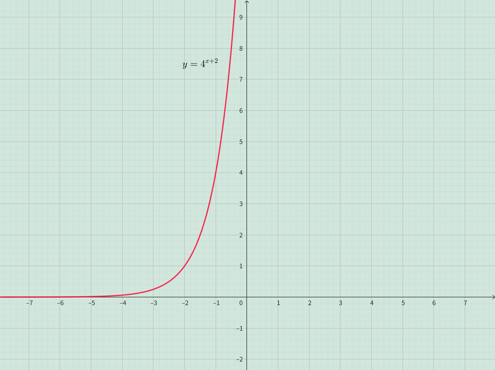   | 

----

**Problem 13**

The graph of $y = 1 - \frac{1}{2}e^{-x}$ can be obtained from problem 11 $y =-e^{-x}$ by shrinking vertically by a factor of $2$ and then shifting $1$ unit upward.

| $y = -e^{-x}$     |                              | $y = -\frac{1}{2}e^{-x}$    |        | $y = 1-\frac{1}{2}e^{-x}$        |
| ------------------------- | :--------------------------: | ------------------------- | :----: | ----------- |
|  |  $_\uparrow^\downarrow 2 \\ \implies$  | 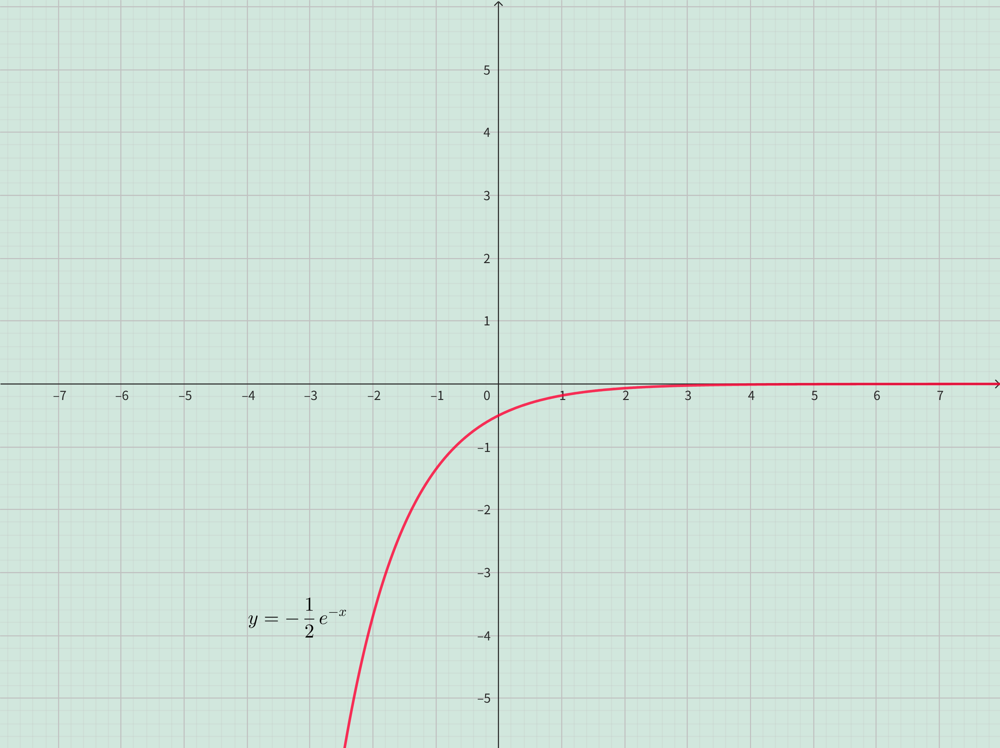 | $ \uparrow 1 \\ \implies$ | 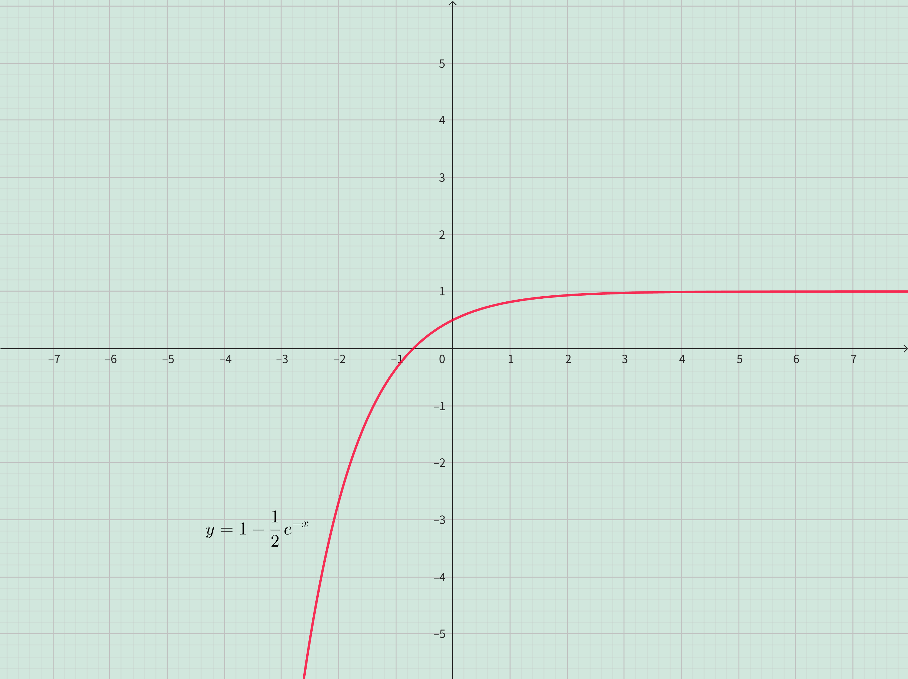    |

----

**Problem 14**

The graph of $y = e^{|x|}$ can be obtained from the graph of $y = e^x$ by reflecting the graph right the $y$-axis about the $y$-axis. 
. 

| $y = 4^x$                 |                              | $y = 4^{x+2}$               |
| ------------------------- | :--------------------------: | --------------------------- |
| 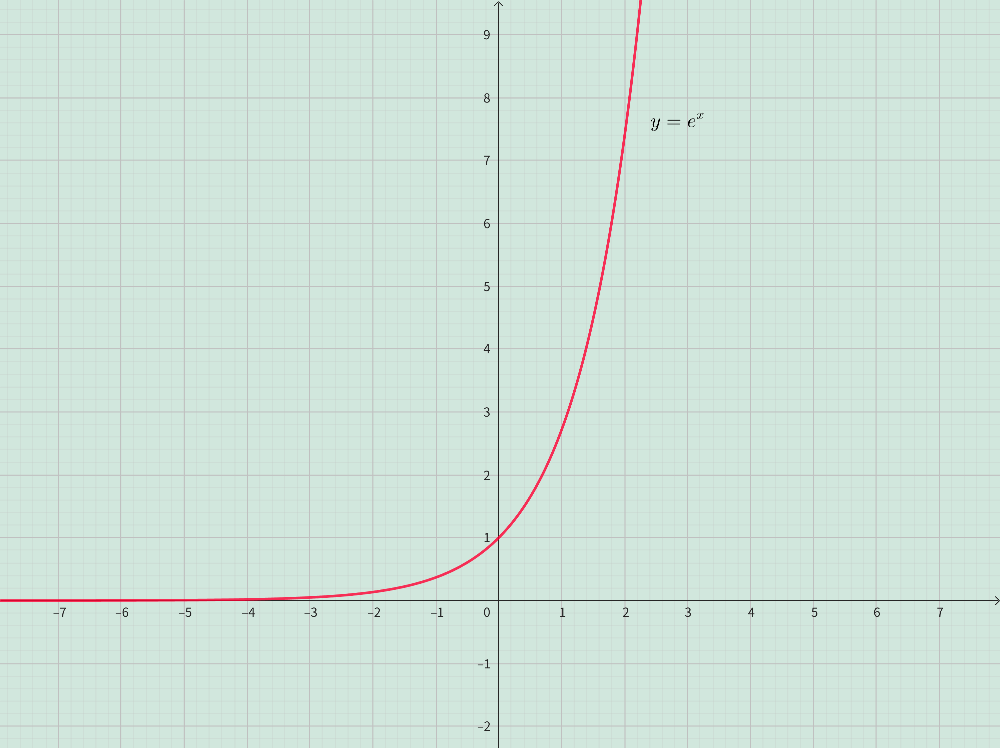 |  $\leftharpoonup \\ \implies$    | 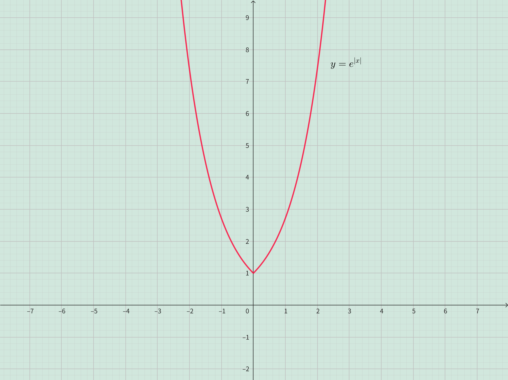   | 

